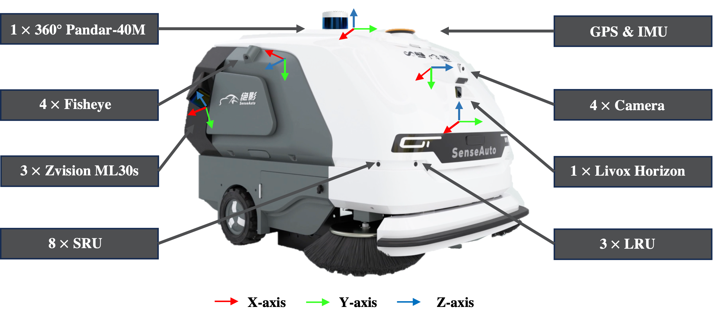
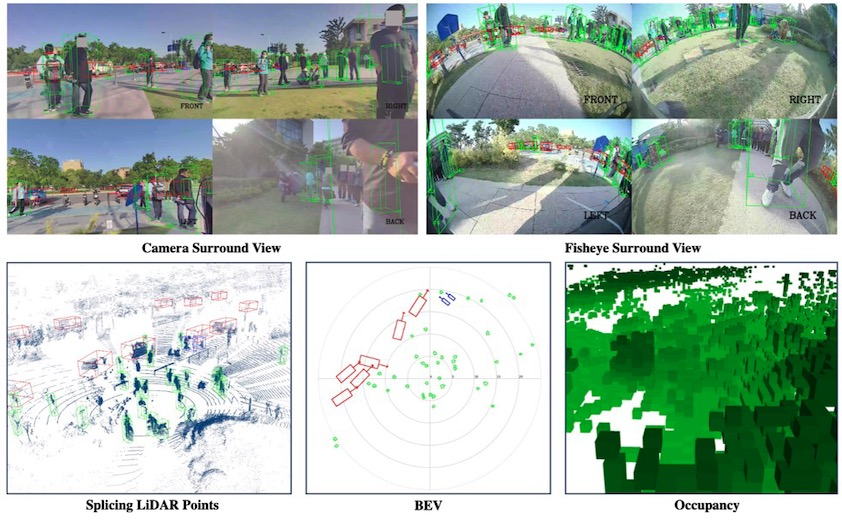
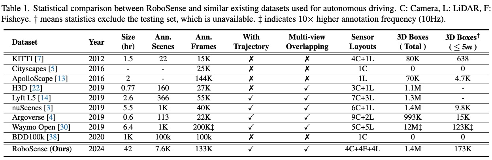
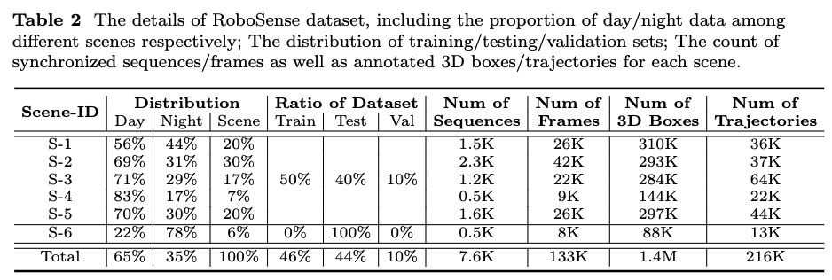

<div align="center">

<h1>RoboSense</h1>
<h3>Large-scale Dataset and Benchmark for Egocentric Robot Perception and Navigation in Crowded and Unstructured Environments</h3>

[Haisheng Su](https://scholar.google.com.hk/citations?user=OFrMZh8AAAAJ&hl=zh-CN)<sup>1,2</sup>, Feixiang Song<sup>2</sup>, Cong Ma<sup>2</sup>, [Wei Wu](https://scholar.google.com.hk/citations?hl=zh-CN&user=9RBxtd8AAAAJ)<sup>2,3</sup>, [Junchi Yan](https://thinklab.sjtu.edu.cn/)<sup>1 :email:</sup>

<sup>1</sup> School of AI and Department of CSE, SJTU \
<sup>2</sup> SenseAuto Research, <sup>3</sup> Tsinghua University

:email:: Corresponding author, yanjunchi@sjtu.edu.cn

<!-- ArXiv Preprint ([arXiv 2408.15503]()) -->

[](https://arxiv.org/abs/2408.15503)

</div>


## News
* **` Mar. 9th, 2025`:** Our paper has been accepted to CVPR 2025!
* **` Aug. 25th, 2024`:** We released our paper on [Arxiv](https://arxiv.org/abs/2408.15503). Code and dataset are coming soon. Please stay tuned! ☕️


## Table of Contents
- [Introduction](#introduction)
- [Sensor Setup and Coordinate System](#sensor-setup-and-coordinate-system)
- [Dataset Example](#dataset-example)
- [Dataset Comparison](#dataset-comparison)
- [Dataset Download](#dataset-download)
- [Benchmark Setup](#benchmark-setup)
- [Contact](#contact)
- [Citation](#citation)


## Introduction
Reliable embodied perception from an egocentric perspective is challenging yet essential for autonomous navigation technology of intelligent mobile agents. With the growing demand of social robotics, near-field scene understanding becomes an important research topic in the areas of egocentric perceptual tasks related to navigation in both crowded and unstructured environments. Due to the complexity of environmental conditions and difficulty of surrounding obstacles owing to truncation and occlusion, the perception capability under this circumstance is still inferior. To further enhance the intelligence of mobile robots, in this paper, we setup an egocentric multi-sensor data collection platform based on 3 main types of sensors (Camera, LiDAR and Fisheye), which supports flexible sensor configurations to enable dynamic sight of view from ego-perspective, capturing either near or farther areas. Meanwhile, a large-scale multimodal dataset is constructed, named RoboSense, to facilitate egocentric robot perception. Specifically, RoboSense contains more than 133K synchronized data with 1.4M 3D bounding box and IDs annotated in the full $360^{\circ}$ view, forming 216K trajectories across 7.6K temporal sequences. It has $270\times$ and $18\times$ as many annotations of surrounding obstacles within near ranges as the previous datasets collected for autonomous driving scenarios such as KITTI and nuScenes. Moreover, we define a novel matching criterion for near-field 3D perception and prediction metrics. Based on RoboSense, we formulate 6 popular tasks to facilitate the future research development, where the detailed analysis as well as benchmarks are also provided accordingly. Data desensitization measures have been conducted for privacy protection.


## Sensor Setup and Coordinate System
<div align="center">

</div>


## Dataset Example
<div align="center">

</div>


## Dataset Comparison
<div align="center"></div>


## Dataset Download
Coming soon... ☕️


## Benchmark Setup
<div align="center"></div>

## License <a name="license"></a>

All assets and code are under the [CC-BY-NC-ND](./LICENSE) unless specified otherwise.

## Contact
If you have any questions, please contact [Haisheng Su](https://scholar.google.com.hk/citations?user=OFrMZh8AAAAJ&hl=zh-CN) via email (suhaisheng@sjtu.edu.cn).

## Citation
If you find RoboSense is useful in your research or applications, please consider giving us a star 🌟 and citing it by the following BibTeX entry.

```bibtex
@article{su2024robosense,
  title={RoboSense: Large-scale Dataset and Benchmark for Egocentric Robot Perception and Navigation in Crowded and Unstructured Environments},
  author={Su, Haisheng and Song, Feixiang and Ma, Cong and Wu, Wei and Yan, Junchi},
  journal={arXiv preprint arXiv:2408.15503},
  year={2024}
}
```