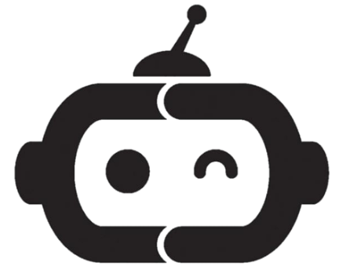

<div id="top" align="center">


<!-- <div align="center"> -->

<!-- <h1>RoboSense</h1> -->
<h3>Large-scale Dataset and Benchmark for Egocentric Robot Perception and Navigation in Crowded and Unstructured Environments</h3>

[Haisheng Su](https://scholar.google.com.hk/citations?user=OFrMZh8AAAAJ&hl=zh-CN)<sup>1,2</sup>, Feixiang Song<sup>2</sup>, Cong Ma<sup>2</sup>, [Wei Wu](https://scholar.google.com.hk/citations?hl=zh-CN&user=9RBxtd8AAAAJ)<sup>2,3</sup>, [Junchi Yan](https://thinklab.sjtu.edu.cn/)<sup>1 :email:</sup>

<sup>1</sup> School of Computer Science and School of AI, SJTU \
<sup>2</sup> SenseAuto Research, <sup>3</sup> Tsinghua University

<sup>:email:</sup> Corresponding author, yanjunchi@sjtu.edu.cn


<!-- [](https://arxiv.org/abs/2408.15503) -->

<a href="https://arxiv.org/abs/2408.15503">"></a> [](https://huggingface.co/datasets/suhaisheng0527/RoboSense) [](https://creativecommons.org/licenses/by-nc-sa/4.0/)


</div>


<!-- ## Introduction -->
RoboSense is a large-scale multimodal dataset constructed to facilitate egocentric robot perception capabilities especially in crowded and unstructured environments.
<!-- * It contains more than 133K synchronized data of 3 main types of sensors (Camera, LiDAR and Fisheye), with 1.4M 3D bounding box and IDs annotated in the full $360^{\circ}$ view, forming 216K trajectories across 7.6K temporal sequences.
* It has $270\times$ and $18\times$ as many annotations of surrounding obstacles within near ranges as the previous datasets collected for autonomous driving scenarios such as KITTI and nuScenes. 
* Based on RoboSense, we formulate 6 benchmarks of both perception and prediction tasks to facilitate the future research development. -->


## Table of Contents
1. [News](#news)
2. [Key Features](#keyfeatures)
3. [Sensor Setup and Coordinate System](#sensor-setup-and-coordinate-system)
4. [Dataset Example](#dataset-example)
5. [Getting started](#installation)
6. [Tools](#tools)
7. [Evaluation](#evaluation)
8. [Contact](#contact)
9. [Citation](#citation)
<!-- - [Dataset Download](#dataset-download) -->
<!-- - [Benchmark Setup](#benchmark-setup) -->


<!-- ## News -->
## News 📰 <a name="news"></a>
* **`[2025/06/05]`:** 🤖  <span style="color: #B91C1C; font-weight: bold;">RoboSense dataset released, including training/validation splits.</span>
* **`[2025/03/09]`:** Our paper has been accepted to CVPR 2025, [[Poster]](./assets/cvpr2025_robosense_poster.png)!
* **`[2024/08/25]`:** We released our paper on [Arxiv](https://arxiv.org/abs/2408.15503). Code and dataset are coming soon. Please stay tuned! ☕️


## Key Features 🔑 <a name="keyfeatures"></a>

- **133k+** synchronized frames of **4C+4F+4L** sensor data.
- **1.4 million+** 3D bounding boxes and IDs annotated in the full 360°view.
- **7.6K** temporal sequences across 6 kinds of target domains (i.e., scenic spots, parks, squares, campuses, streets and sidewalks).
- **216K+** trajectories of objects.
- **270x and 18x** as many annotations of near-field obstacles as KITTI and nuScenes.
- **6 benchmarks** for both perception and prediction tasks.


## Sensor Setup and Coordinate System


<div align="center">

</div>


<!-- <div style="max-width: 100%; overflow-x: auto; margin: 0 auto; !important;">
  <table style="border-collapse: collapse; border-spacing: 0; width: 100%; table-layout: fixed;">
    <tr style="border: none;">
      <td align="center" style="border: none; padding: 10px;">
        
        <p><b>Contact-rich Manipulation</b></p>
      </td>
      <td align="center" style="border: none; padding: 10px;">
        
        <p><b>Dataset Example</b></p>
      </td>
    </tr>
  </table>
</div> -->


## Dataset Example
<div align="center">

</div>


<!-- ## Dataset Comparison
<div align="center"></div> -->


## Getting started 🔥 <a name="gettingstarted"></a>

#### Installation <a name="installation"></a>

- Download our source code:
```bash
git clone https://github.com/suhaisheng/RoboSense.git
cd RoboSense
```

#### How to Get Started with Our RoboSense Data <a name="preaparedata"></a>

- Download data from our [HuggingFace](https://huggingface.co/datasets/suhaisheng0527/RoboSense) page.

```bash
huggingface-cli download --resume-download --repo-type dataset suhaisheng0527/RoboSense --local-dir ./
```


- Combine all splitted files for image and LiDAR&OCC respectively.

```bash
cd dataset
cat image_trainval_part_* > image_trainval.tar.gz
cat lidar_occ_trainval_part_* > lidar_occ_trainval.tar.gz
rm image_trainval_part_*
rm lidar_occ_trainval_part_*
tar -xzf image_trainval.tar.gz
tar -xzf lidar_occ_trainval.tar.gz
cd ..
```

<!-- Convert the data to **LeRobot Dataset** format.

```bash
python scripts/convert_to_lerobot.py --src_path /path/to/agibotworld/alpha --task_id 390 --tgt_path /path/to/save/lerobot
``` -->

<!-- #### Visualize Datasets <a name="visualizedatasets"></a>

We adapt and extend the dataset visualization script from [LeRobot Project](https://github.com/huggingface/lerobot/blob/main/lerobot/scripts/visualize_dataset.py)

```bash
python scripts/visualize_dataset.py --task-id 390 --dataset-path /path/to/lerobot/format/dataset
``` -->

## Tools <a name="tools"></a>

- Visualize the dataset sample.

```bash
cd scripts
python visualize_dataset.py
```


- Generate the occupancy label.

```bash
cd scripts
python occ_label_gen.py
```

## Evaluation <a name="evaluation"></a>
<!-- <div align="center"></div> -->

- Evaluating detection models with our proposed metrics (CCDP: Closest-
Collision Distance Proportion matching function).

```bash
cd evaluation
cd det_metrics
python robosense_evaluator.py
```

- Evaluating motion prediction results.

```bash
cd evaluation
python evaluate_motion.py
```

- Evaluating occupancy prediction results.

```bash
cd evaluation
python evaluate_occ.py
```

- As for multi-object tracking result evaluation, please refer to this repo: [AB3DMOT](https://github.com/xinshuoweng/AB3DMOT).


## License <a name="license"></a>

All assets and code within this repo are under the [CC BY-NC-SA 4.0](https://creativecommons.org/licenses/by-nc-sa/4.0/) unless specified otherwise.

## Contact
If you have any questions, please contact [Haisheng Su](https://scholar.google.com.hk/citations?user=OFrMZh8AAAAJ&hl=zh-CN) via email (suhaisheng@sjtu.edu.cn).

## Citation
If you find RoboSense is useful in your research or applications, please consider giving us a star 🌟 and citing it by the following BibTeX entry.

```bibtex
@inproceedings{su2025robosense,
  title={RoboSense: Large-scale Dataset and Benchmark for Egocentric Robot Perception and Navigation in Crowded and Unstructured Environments},
  author={Su, Haisheng and Song, Feixiang and Ma, Cong and Wu, Wei and Yan, Junchi},
  booktitle={Proceedings of the IEEE Conference on Computer Vision and Pattern Recognition},
  year={2025}
}
```